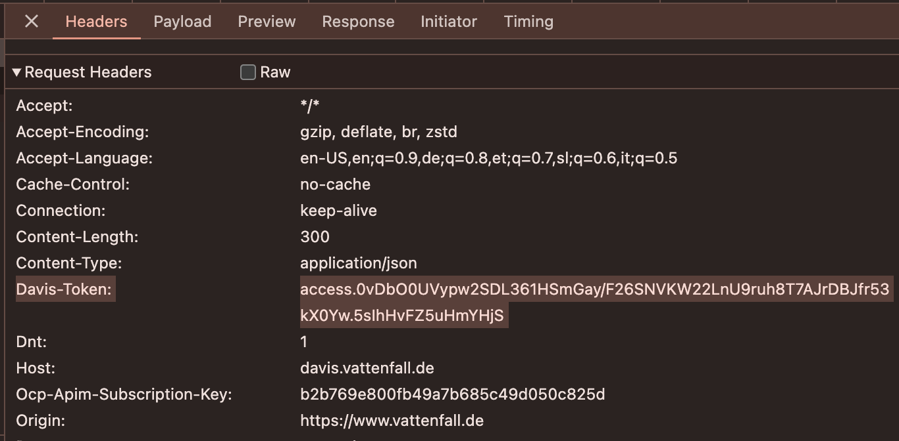

# Strom Börsenpreis

Get current German electricity prices from [Vattenfall Börsenpreise](https://www.vattenfall.de/strom/tarife/oekostrom-dynamik-boersenpreise) and create a diagram with today's and 
tomorrow's prices (if available). Tomorrow's prices are published between noon and 3 PM each day and are not visible in
the web UI of Vattenfall. But the API provides them and so they will appear in this app.

You need to fill the `david_token` variable before calling the program or it will result in an error. You can get the
token by opening the website in your browser and copying it from the (Chrome) Developer Tools *Network* tab when
switching the date:

Testing Python 3.13 with this project. (Noticed that pandas 2.2.2 needed to be compiled on macOS with 3.13, so left it
out in the Dockerfile).

## TODO

* [x] Add functionality to get davis-token (required)
* [x] Add today and tomorrow labels
* [x] Add Dockerfile
* [ ] Idea: Gradio app that can run in HF Spaces?