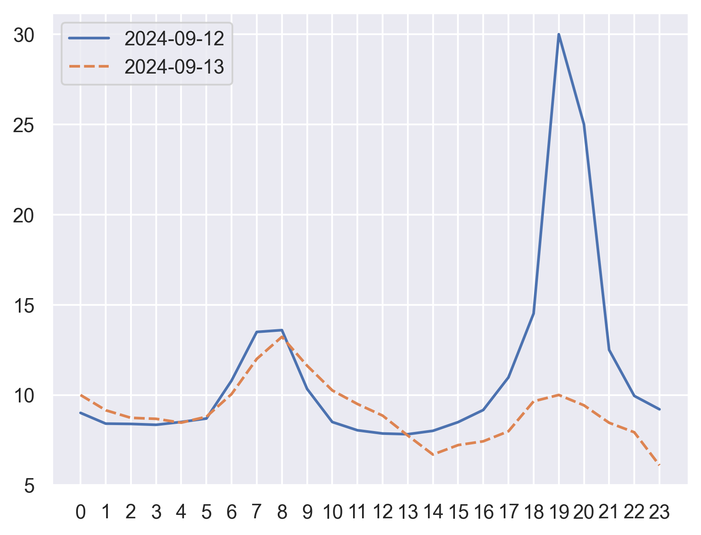

# Strom Börsenpreis

Get current German electricity prices from [Vattenfall Börsenpreise](https://www.vattenfall.de/strom/tarife/oekostrom-dynamik-boersenpreise) and create a diagram with today's and 
tomorrow's prices (if available). Tomorrow's prices are published between noon and 3 PM each day and are not visible in
the web UI of Vattenfall. But the API provides them, so they will appear in this app.


*Sample diagram output of the program*

## Usage

This assumes you have [Astral uv](https://github.com/astral-sh/uv) installed.

After cloning the repository (e.g. `git clone --depth 1 https://github.com/velaia/electricity-price-vattenfall.git`),
simply run the following command:
```commandline
uv run main.py
```
This creates a virtual environment with all the required dependencies and gets the latest (predicted) electricity prices
from the Vattenfall homepage. It also updates the `dual_timeline_plot.png` diagram.

Here's a sample output of the program:
```commandline
ic| davis_token: 'access.YDFgCc5hEk66G5OmKklNVFQfOfxSoV945zw93MGgHft2riKStBoO3TVNXgBB.0TA+zFItXzdfd3Xu'
ic| response_json: {'LogId': 'E02C43E81D9A43BF8DC54C1FD4CF86EB',
                    'Meldungen': [],
                    'ParentLogId': 'DBB70020199043F1A1FD07BC75801BD0',
                    'Result': {'Bis': '2024-09-12',
                               'Einheit': 'ct/kWh',
                               'PreisBrutto': 12.1,
                               'PreisNetto': 10.16,
                               'Raster': '60min',
                               'Tage': [{'Datum': '2024-09-12',
                                         'Mwst': 19.0,
                                         'PreisBrutto': 13.37,
                                         'PreisNetto': 11.234,
                                         'WerteBrutto': {'0': 10.718,
                                                         '1': 10.008,
                                                         '10': 10.115,
                                                         '11': 9.569,
                                                         '12': 9.356,
                                                         '13': 9.31,
                                                         '14': 9.534,
                                                         '15': 10.107,
                                                         '16': 10.909,
                                                         '17': 13.06,
                                                         '18': 17.278,
                                                         '19': 35.702,
                                                         '2': 9.988,
                                                         '20': 29.753,
                                                         '21': 14.875,
                                                         '22': 11.837,
                                                         '23': 10.953,
                                                         '3': 9.931,
                                                         '4': 10.118,
                                                         '5': 10.344,
                                                         '6': 12.848,
                                                         '7': 16.058,
                                                         '8': 16.177,
                                                         '9': 12.3},
                                         'WerteNetto': {'0': 9.006,
                                                        '1': 8.41,
                                                        '10': 8.5,
                                                        '11': 8.041,
                                                        '12': 7.862,
                                                        '13': 7.823,
                                                        '14': 8.011,
                                                        '15': 8.493,
                                                        '16': 9.167,
                                                        '17': 10.974,
                                                        '18': 14.519,
                                                        '19': 30.001,
                                                        '2': 8.393,
                                                        '20': 25.002,
                                                        '21': 12.5,
                                                        '22': 9.947,
                                                        '23': 9.204,
                                                        '3': 8.345,
                                                        '4': 8.502,
                                                        '5': 8.692,
                                                        '6': 10.796,
                                                        '7': 13.494,
                                                        '8': 13.594,
                                                        '9': 10.336}},
                                        {'Datum': '2024-09-13',
                                         'Mwst': 19.0,
                                         'PreisBrutto': 10.81,
                                         'PreisNetto': 9.081,
                                         'WerteBrutto': {'0': 11.897,
                                                         '1': 10.891,
                                                         '10': 12.203,
                                                         '11': 11.304,
                                                         '12': 10.538,
                                                         '13': 9.223,
                                                         '14': 7.969,
                                                         '15': 8.592,
                                                         '16': 8.842,
                                                         '17': 9.503,
                                                         '18': 11.48,
                                                         '19': 11.9,
                                                         '2': 10.39,
                                                         '20': 11.216,
                                                         '21': 10.064,
                                                         '22': 9.437,
                                                         '23': 7.258,
                                                         '3': 10.325,
                                                         '4': 10.071,
                                                         '5': 10.463,
                                                         '6': 11.959,
                                                         '7': 14.276,
                                                         '8': 15.737,
                                                         '9': 13.833},
                                         'WerteNetto': {'0': 9.997,
                                                        '1': 9.152,
                                                        '10': 10.254,
                                                        '11': 9.499,
                                                        '12': 8.855,
                                                        '13': 7.75,
                                                        '14': 6.696,
                                                        '15': 7.22,
                                                        '16': 7.43,
                                                        '17': 7.985,
                                                        '18': 9.647,
                                                        '19': 10.0,
                                                        '2': 8.731,
                                                        '20': 9.425,
                                                        '21': 8.457,
                                                        '22': 7.93,
                                                        '23': 6.099,
                                                        '3': 8.676,
                                                        '4': 8.463,
                                                        '5': 8.792,
                                                        '6': 10.049,
                                                        '7': 11.996,
                                                        '8': 13.224,
                                                        '9': 11.624}}],
                               'Von': '2024-09-12'},
                    'StatusCode': 'OK'}
                0      1      2      3  ...      20      21     22     23
2024-09-12  9.006  8.410  8.393  8.345  ...  25.002  12.500  9.947  9.204
2024-09-13  9.997  9.152  8.731  8.676  ...   9.425   8.457  7.930  6.099

[2 rows x 24 columns]
```

## Docker

You can build a Docker image by running
```commandline
doker build -t vattenfall-prices-germany:0.1 .
```

## TODO

* [x] Add functionality to get davis-token (required)
* [x] Add today and tomorrow labels
* [x] Add Dockerfile
* [x] Update usage
* [ ] Idea: Gradio app that can run in HF Spaces?
* [ ] package?