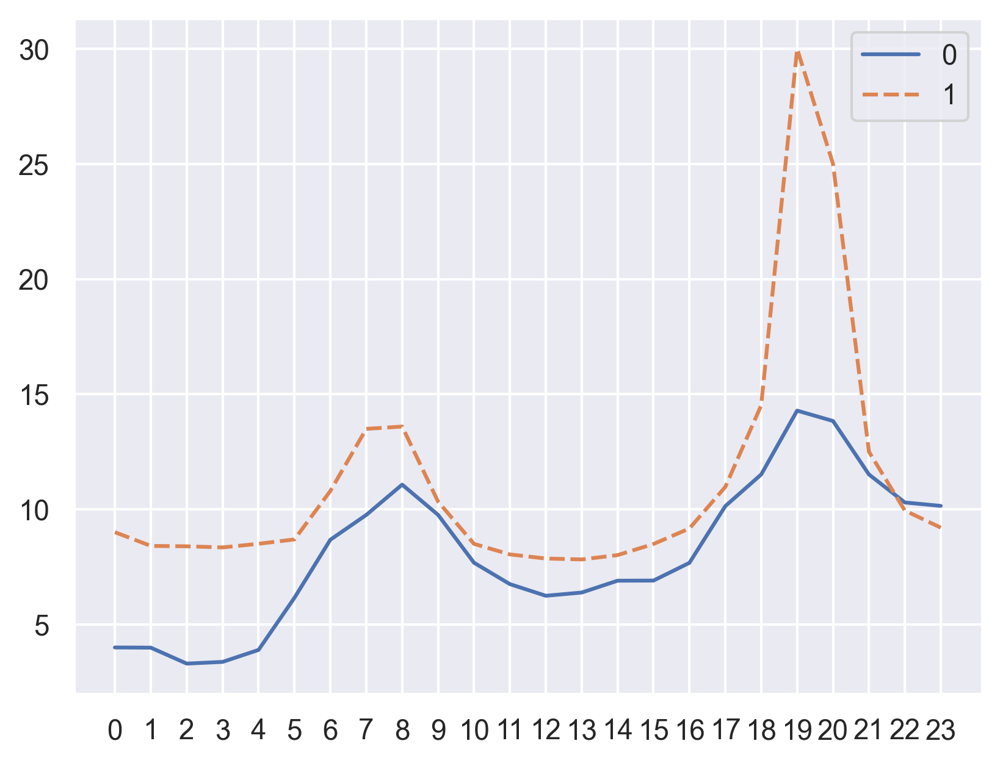

# Strom Börsenpreis

Get current German electricity prices from [Vattenfall Börsenpreise](https://www.vattenfall.de/strom/tarife/oekostrom-dynamik-boersenpreise) and create a diagram with today's and tomorrow's prices (if available).

Testing Python 3.13 with this project. (Noticed that pandas 2.2.2 needed to be compiled on macOS with 3.13).

## TODO

* [ ] Add functionality to get davis-token (required)
* [ ] Add today and tomorrow labels