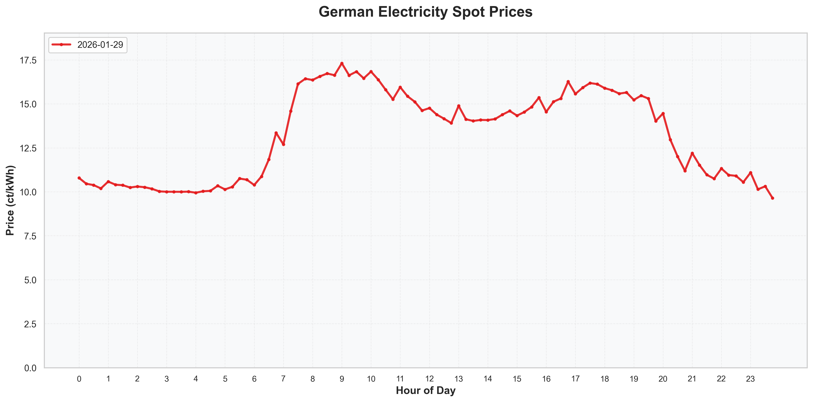

# Strom Börsenpreis

Holen Sie sich aktuelle deutsche Strompreise von [Vattenfall Börsenpreise](https://www.vattenfall.de/strom/tarife/oekostrom-dynamik-boersenpreise) — plus Day-Ahead-Preise für Deutschlands Nachbarländer von [energy-charts.info](https://www.energy-charts.info) — und nutzen Sie sie als Diagramme, Home-Assistant-Sensoren oder über einen MCP-Server.

Die Preise für morgen werden zwischen 12:00 und 15:00 Uhr veröffentlicht und sind in der Web-UI von Vattenfall nicht sichtbar. Die API stellt sie jedoch bereit, sodass sie in dieser App angezeigt werden.


*Beispieldiagramm der Programmausgabe*

## Funktionen

- Ruft 15-Minuten-Börsenpreise (ct/kWh) für heute und morgen ab
- Deckt Deutschland (Vattenfall-API) sowie FR, NL, BE, AT, CH, PL, CZ, DK ab (energy-charts.info, ohne API-Schlüssel)
- Zwischenspeichert Preise in SQLite (`energy_prices.db`), sodass die API nur bei fehlenden Daten aufgerufen wird
- Erstellt Diagramme in zwei Stilen: klassisch (seaborn) und Synthwave/"futuristisch"
- Veröffentlicht Preissensoren an Home Assistant über MQTT Discovery
- Stellt Diagramm und Daten über einen MCP-Server bereit

## Verwendung

Dies setzt voraus, dass Sie [Astral uv](https://github.com/astral-sh/uv) installiert haben.

### Diagramme

```commandline
uv run main.py
```

Erstellt drei Diagramme im Projektverzeichnis:
- `dual_timeline_plot.png` — stündliche Preise für heute und morgen
- `price_distribution.png` — Tagesmittelwert mit ±1σ-Band
- `price_hourly_profile.png` — Intervallmittelwert über alle Tage mit ±1σ/±2σ-Bändern

Fügen Sie `-f`/`--futuristic` hinzu, um die Synthwave-Varianten zu erzeugen.

### Europäische Länder

Mit `-c`/`--country` können Sie Day-Ahead-Preise für jeden unterstützten Markt darstellen (Standard `DE`):

```commandline
uv run main.py -c FR
uv run main.py -c DK
```

Unterstützte Länder: `DE`, `FR`, `NL`, `BE`, `AT`, `CH`, `PL`, `CZ`, `DK`. Nicht-DE-Daten stammen von [energy-charts.info](https://www.energy-charts.info) (Fraunhofer ISE) — ohne Registrierung oder API-Schlüssel. `DK` verwendet die Gebotszone DK1 (Jütland, mit Deutschland gekoppelt). Die Preise werden pro Land in derselben SQLite-Datenbank zwischengespeichert.

Nicht-DE-Läufe schreiben länderspezifische Dateien, z. B. `dual_timeline_plot_fr.png`, `price_distribution_fr.png`, `price_hourly_profile_fr.png` (plus `_futuristic`-Varianten mit `-f`).

### Vergleichsdiagramm

Mit `--compare` wird ein einziges Diagramm erstellt, das die **top 5 Länder nach Einwohnerzahl** (DE, FR, PL, NL, BE) vergleicht:

```commandline
uv run main.py --compare
uv run main.py --compare -f   # Synthwave-Variante
```

Jedes Land bekommt eine eigene Farbe; die Linie für heute ist durchgezogen, die für morgen gestrichelt in einer helleren Nuance derselben Farbe. Die Legende zeigt alle 10 Reihen (5 Länder × heute/morgen). Ausgabe: `comparison_plot.png` bzw. `comparison_plot_futuristic.png`.

### Home Assistant (MQTT)

```commandline
uv run mqtt_publisher.py
```

Veröffentlicht 8 Sensoren (aktueller Preis, Preis der nächsten Stunde, heute min/max/avg, morgen min/max/avg) an Home Assistant über MQTT Discovery, aktualisiert an jeder 15-Minuten-Grenze. Kopieren Sie `.env.example` nach `.env` und setzen Sie `MQTT_HOST` (sowie `MQTT_USER`/`MQTT_PASS`, falls Ihr Broker eine Authentifizierung verlangt).

### MCP-Server

```commandline
uv run mcp_server.py
```

Stellt zwei Tools bereit: `get_price_chart` (liefert das Diagramm als Bild) und `get_price_data` (Rohdaten als Texttabelle). Läuft standardmäßig über streamable-http; mit `--stdio` für den Stdio-Transport.

### Chat mit Ollama

```commandline
uv run mcp_server.py   # Terminal 1
uv run ollama_chat.py  # Terminal 2
```

Ermöglicht einem lokalen Ollama-Modell (gemma4), Fragen zu Preisen zu beantworten, indem es die Tools des MCP-Servers aufruft.

## Docker

```commandline
docker build -t vattenfall-prices-germany:0.1 .
docker run vattenfall-prices-germany:0.1
```

## Datenbank

Preise werden in `energy_prices.db` (SQLite) zwischengespeichert. Untersuchen Sie sie mit:

```commandline
sqlite3 energy_prices.db < stats.sql
```

## TODO

* [ ] Idee: Gradio-App, die in HF Spaces laufen kann?
* [ ] Paket?
